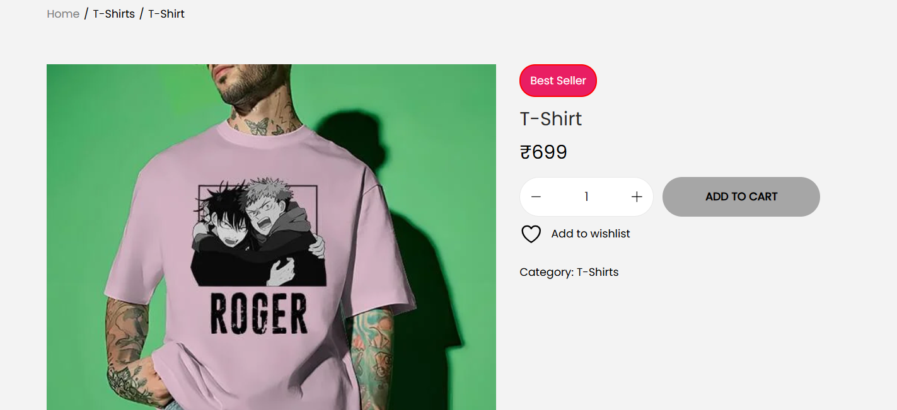
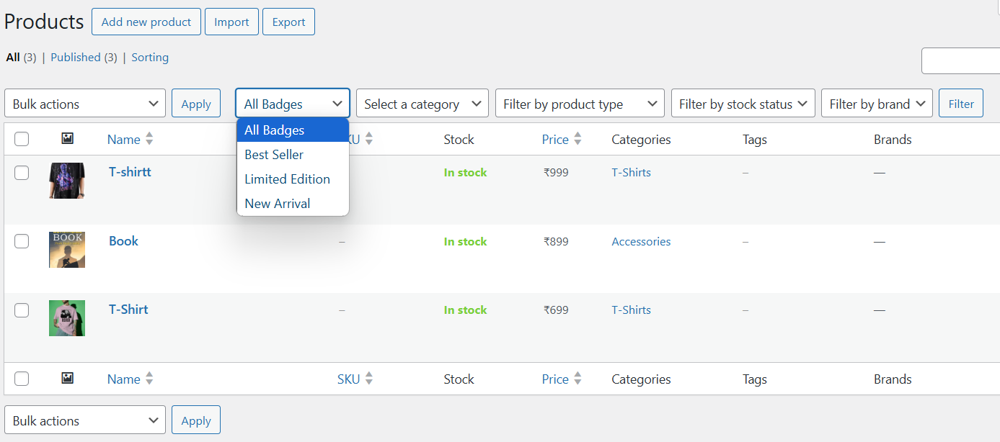
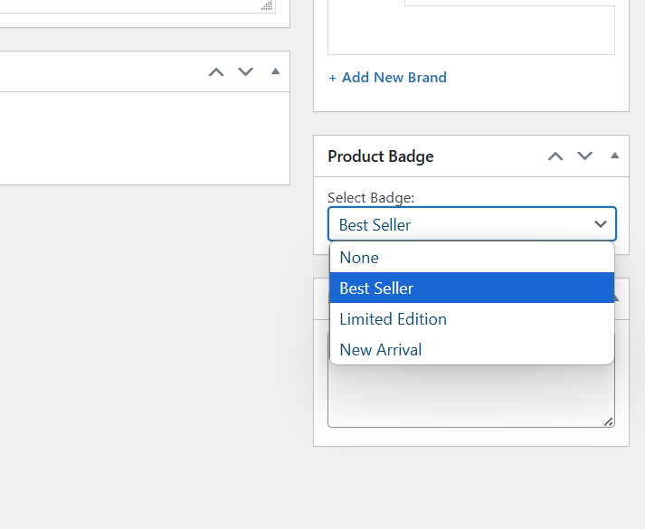

# Woo Custom Badges

Add dynamic and customizable badges to WooCommerce products. Display labels like “New”, “Featured”, “Limited” — and even filter products by badge in the admin panel!

*Badge showing below the product title on the single product page*

## Features

- ✅ Add custom badge text per product
- 🏷️ Display badge on single product pages
- 🧩 Compatible with any WooCommerce theme
- 🔍 Admin filter by badge name
- 🎯 Easy to use via product edit screen

## Screenshots

1.   
   *Badge showing below the product title in single product page.*

2.   
   *Filter products by badge name from the Products screen in WP admin.*

3.   
   *Easily select a badge in the product edit panel.*

## Installation

1. Upload the plugin folder to the `/wp-content/plugins/` directory.
2. Activate the plugin through the 'Plugins' menu in WordPress.
3. Go to any product and scroll down to find the "Custom Badge" input field.
4. Enter a badge name and update the product.

## Frequently Asked Questions

### Q: Can I style the badges?

Yes! You can target the `.woo-custom-badge` CSS class in your theme’s stylesheet to apply colors, borders, etc.

### Q: Will this work with all themes?

This plugin is designed to work with any WooCommerce-compatible theme. If you encounter an issue, you can override the badge placement via template hooks.

## Changelog

### 1.0 – Initial Release

- First public version with:
  - Single product page badge display
  - Admin-side filtering
  - Custom badge input per product

## License

This plugin is licensed under the GPLv2 or later.  
[Learn more about GPL licensing](https://www.gnu.org/licenses/gpl-2.0.html)
